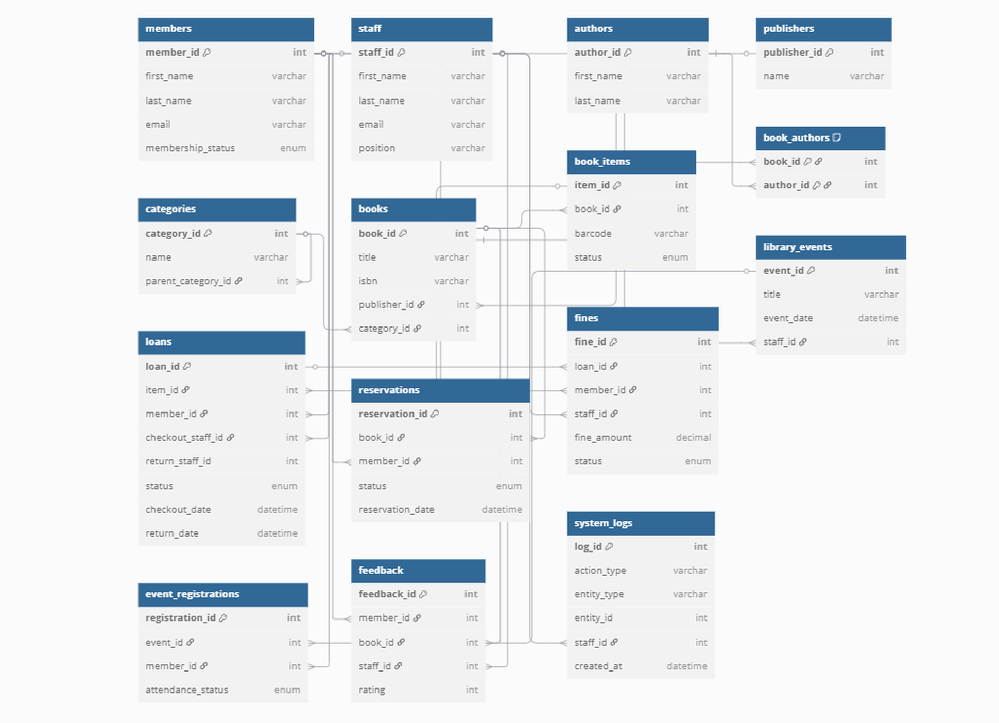

# 📚 Library Management System (MySQL)

A lightweight, **pure‑SQL** database that covers every core workflow of a modern public library—cataloguing, circulation, events, fines, and audit trails—designed for MySQL 8 +

---

## ✨ Features

| Domain              | What’s Included                                                             |
| ------------------- | --------------------------------------------------------------------------- |
| **Catalog**         | Books, physical copies, authors, publishers, hierarchical categories        |
| **Circulation**     | Loans with multi‑role staff tracking, reservations, overdue fine management |
| **Community**       | Library events & registrations                                              |
| **Patrons & Staff** | Members table, staff table with positions                                   |
| **Audit Trail**     | System logs to record key actions (GDPR‑friendly!)                          |
| **ACID Safety**     | InnoDB, foreign‑key constraints, cascading rules                            |

> No ORMs, frameworks, or stored procedures—just clean SQL you can read, learn from, and extend.

---

## 🚀 Quick Start

```bash
# 1 · Clone the repo
$ git clone https://github.com/MuganziJames/database_assignment_week_8.git
$ cd database_assignment_week_8

# 2 · Log into MySQL (8.0+)
$ mysql -u <user> -p

# 3 · Create the schema & import objects
mysql> SOURCE answer.sql;   -- creates and populates all tables
```

**Need sample data?** The schema is empty by default; feel free to add your own inserts or open an issue requesting a starter seed.

---

## 🖼️ Entity‑Relationship Diagram



(Open `library_erd.png` with a viewer for full resolution.)

---

## 🗂️ Repository Structure

```
.
├── answer.sql          # 👉 Full CREATE TABLE script (run this!)
├── library_erd.png     # ER diagram used above
└── README.md           # You’re here
```

---

## 🛠️ Extending the Schema

1. **Add indexes** for your most common joins (e.g., composite index on `(member_id, status)` in `loans`).
2. **Views** – create reporting or BI‑ready views (e.g., `current_loans_v`).
3. **Triggers / procedures** – enforce business rules (auto‑update `outstanding_fines`, send email reminders).
4. **Connectors** – use any MySQL client or ORM; table and column names follow snake\_case for easy mapping.

---

## 🤝 Contributing

Pull requests are welcome—especially for performance tweaks, seed data, or documentation improvements. Open an issue first to discuss major changes.

---

## 📄 License

MIT — see `LICENSE` (feel free to reuse the SQL in personal or commercial projects).

---

### Author

James Muganzi 💻

